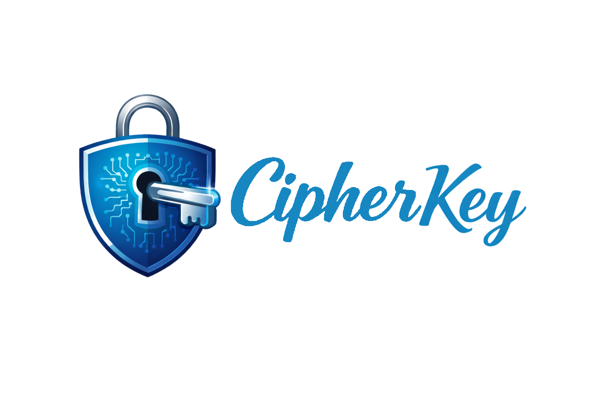
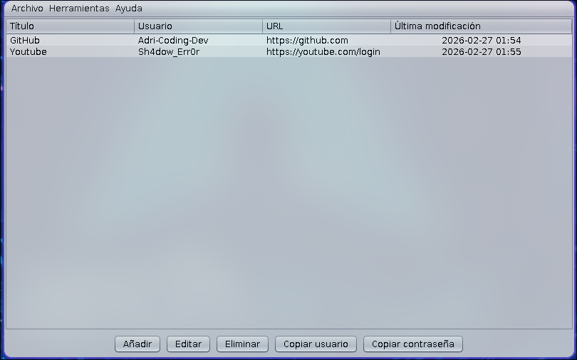
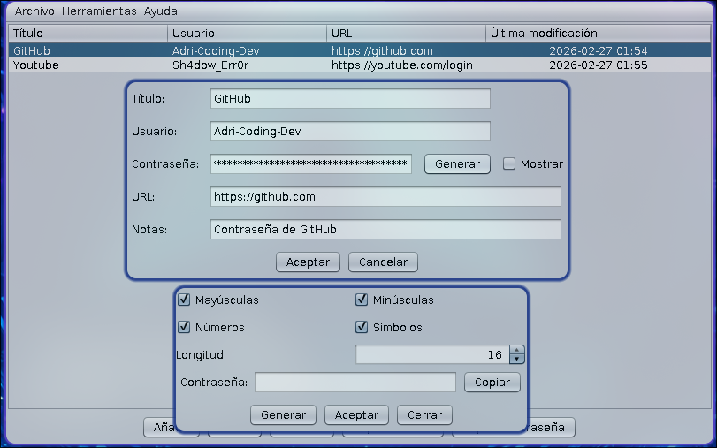

<p align="center">
  
</p>

<p align="center">
  <strong>Robusto - Simple - Seguro.</strong><br>
  Gestor de contraseñas, 100% offline, desarrollado en Java.
</p>

<p align="center">
  
  
  
  
</p>

---

## 📌 ¿De que trata este proyecto?

**CipherKey** es un gestor de contraseñas cifrado y completamente offline desarrollado en **Java (JDK 25)** con **Java Swing**.

Permite:

- 🔐 Crear un espacio de contraseñas protegido con una llave maestra
- 🗂️🗂️Amacenamiento de credenciales a prueba de fuerza bruta
- 🔑 Generador de contraseñas seguras (hasta 64 caracteres)
- ☁️ Aplicacion completamente offline

> __Tu seguridad no debería depender de terceros.__

---

## 🖥️ VCómo se ve la aplicación?


### **Pantalla de login**

<p align="center">
  
</p>

### **Dashboard**

<p align="center">
  
</p>

### **Generador de contraseñas**

<p align="center">
  
</p>

---

## 🛡️ Seguridad

| Características | Implementaciones |
|---------------|----------------|
| Master key | Protección obligatoria |
| Hash seguro | SHA-256 |
| Persistencia de datos | JSON cifrado |
| Archivo de clave cifrado | `.ckey` |
| Seguridad en memoria | Limpieza de datos sensibles tras 30s o tras usarlo |
| Longitud de la contraseña | Hasta 64 caracteres de contraseña para mayor seguridad |

---

## 🏗️ Arquitectura

| Tecnología | Uso |
|------------|------|
| Java JDK 25 | Core del sistema |
| Java Swing | Interfaz gráfica |
| Maven | Gestión de dependencias |
| org.json | Dependia de cifrado de JSON |

---

## ⚙️ Funcionalidades

- ✅ Creación de bóveda
- ✅ Acceso mediante clave maestra
- ✅ Generación de contraseñas seguras
- ✅ Gestión por usuario, dominio, URL y Notas
- ✅ Eliminación segura en memoria

---

## 🚀 Instalación

### 📋 Requisitos

- Java JDK 25
- Maven

### 🔨 Compilación

```java
mvn clean package
```
▶️ Ejecución
```java
java -jar target/cipherkey.jar
```
📊 Estado del Proyecto

🟡 **Beta**

El proyecto es funcional pero está en evolución constante, con búsqueda de errores y posibles mejoras de optimización y seguridad.
Se planean mejoras en:

> UI/UX

> Optimización de cifrado

> Tests unitarios con JUNIT

> Escalabilidad en futuras adaptaciones

### 📄 Licencia

Distribuido bajo licencia MIT.

<p align="center"> Hecho con ☕ y Java </p>
