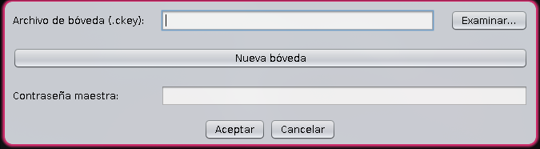
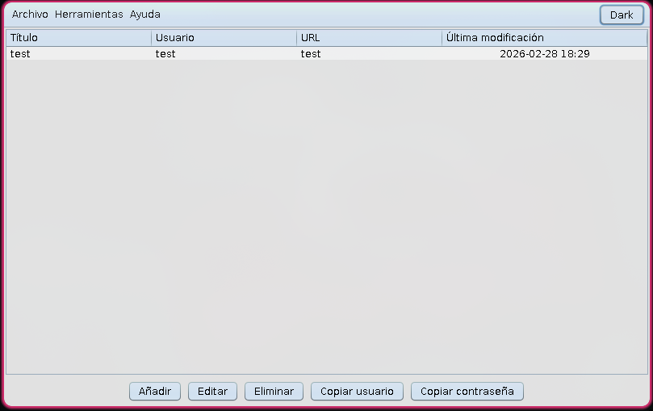
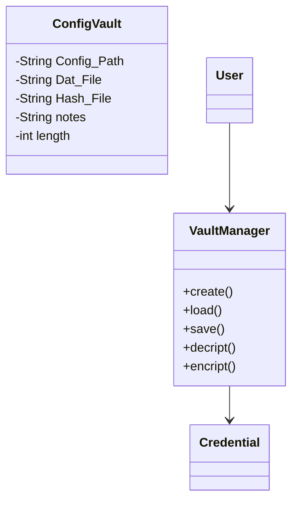

<p align="center">
  
</p>
<p align="center">
  <strong>Robusto • Simple • Seguro • 100% Offline</strong><br>
  Gestor de contraseñas cifrado desarrollado en Java
</p>

<p align="center">
  
  
  
  
  
</p>

---

# 📚 Índice

- [📌 Descripción](#-descripción)
- [✨ Características](#-características)
- [🛡️ Seguridad](#-seguridad)
- [🏗️ Arquitectura](#️-arquitectura)
- [📂 Estructura del Proyecto](#-estructura-del-proyecto)
- [🖥️ Manual de Usuario](#️-manual-de-usuario)
- [🚀 Instalación Paso a Paso](#-instalación-paso-a-paso)
- [🧪 Tests](#-tests)
- [📊 Diagramas](#-diagramas)
- [🔄 Versionado](#-versionado)
- [🤝 Contribuir](#-contribuir)
- [📄 Licencia](#-licencia)

---

# 📌 Descripción

**CipherKey** es un gestor de contraseñas seguro, completamente offline, desarrollado en **Java (JDK 25)** utilizando **Java Swing** para la interfaz gráfica.

Su objetivo es proporcionar almacenamiento cifrado local sin depender nada ajeno al ordenador local.

### 🔒 *__Tu seguridad no debería depender de terceros.__*

---

# ✨ Características

- 🔐 Creación de bóveda protegida con clave maestra
- 🔑 Generador de contraseñas seguras (hasta 64 caracteres)
- 🗂️ Gestión de credenciales por usuario, dominio, URL y notas
- 🛡️ Datos cifrados en archivo `.ckey`
- 🧹 Limpieza automática de datos sensibles en memoria (30 seg)
- 🌐 100% offline

---

# 🛡️ Seguridad

| Característica | Implementación |
|---------------|---------------|
| Hash de clave maestra | SHA-256 |
| Persistencia | JSON cifrado |
| Protección contra fuerza bruta (300k iteraciones) | Validación y cifrado robusto |
| Limpieza de memoria | Eliminación tras uso o timeout |
| Longitud máxima contraseña | 64 caracteres |

### 🔐 Decisiones de Seguridad

- No se almacenan contraseñas en texto plano.
- No existe conexión a red.
- El archivo `.ckey` contiene los datos cifrados.
- La clave maestra nunca se guarda.

---

# 🏗️ Arquitectura

CipherKey sigue una arquitectura inspirada en el patrón **MVC (Model-View-Controller)** para separar responsabilidades.

| Capa | Responsabilidad |
|------|----------------|
| Model | Representación de datos (Credenciales, Usuario) |
| View | Interfaces gráficas con Swing |
| Controller | Lógica de la gestion de Contraseñas y bovedas |
| Security | Cifrado, persistencia y seguridad |
| Persistence | Utilidades de configuracion y guardado |

---

# 📂 Estructura del Proyecto

```
src/
 └── main/
     └── java/com/cipherkey/
         ├── model/
         ├── view/
         ├── controller/
         ├── service/
         ├── security/
         └── util/
```

### Justificación

- Separación clara de responsabilidades.
- Facilita escalabilidad.
- Permite testear la lógica sin depender de la UI.
- Mejora mantenibilidad.

---

# 🖥️ Manual de Usuario

## 1️⃣ Pantalla de Login

- Introducir clave maestra.
- Si es la primera vez, se crea la bóveda.

<p align="center">
  
</p>

---

## 2️⃣ Dashboard (Modo claro)

- Visualizar credenciales guardadas.
- Añadir / editar / eliminar entradas.

<p align="center">
  
</p>

## Dashboard (Modo oscuro)

<p align="center">
  
</p>

---

## 3️⃣ Generador de Contraseñas

- Seleccionar longitud.
- Generar contraseña segura.
- Copiar al portapapeles.

<p align="center">
  
</p>

---

# 🚀 Instalación Paso a Paso

## 📋 Requisitos

- Java JDK 25
- Maven 3.9+
- Sistema operativo: Windows / Linux / macOS (.jar)
  
---

## 1️⃣ Clonar repositorio

```bash
git clone https://github.com/Adri-Coding-Dev/CipherKey.git
cd cipherkey
```

## 2️⃣ Compilar proyecto

```bash
mvn clean package
```

## 3️⃣ Ejecutar aplicación

```bash
java -jar target/cipherkey<VERSION>.jar
```

## 4️⃣ Primera ejecución

- Se pedirá clave maestra.
- Se generará archivo `.ckey` en el directorio elegido.

---

# 🧪 Tests

El proyecto NO incluye pruebas unitarias en su version mas actual (Version 2.0).
Aun asi, está en fase de desarrollo

Cobertura:
- Generador de contraseñas
- Lógica de cifrado
- Validaciones de autenticación

---

# 📊 Diagramas

## 🔷 Diagrama de Clases (UML)



---

## 🔷 Flujo de Autenticación

```mermaid
flowchart TD
    A = ([Usuario introduce clave]) --> B = ([Hash SHA-256])
    B --> C = (¿Coincide?)
    C -->|Sí| D = ([Acceso al Dashboard])
    C -->|No| E = ([Error de autenticación]) --> A
```

---

# 🔄 Versionado

El proyecto sigue.

## V[Beta]

### Added
- Sistema de autenticación con clave maestra
- Persistencia cifrada `.ckey`
- Interfaz gráfica Swing

## V[1.0]

### Added
- Sistema de autenticación con clave maestra
- Generador de contraseñas
- Persistencia cifrada `.ckey`
- Interfaz gráfica Swing

  ## V[1.0]

### Added
- Sistema de autenticación con clave maestra
- Generador de contraseñas
- Persistencia cifrada `.ckey`
- Interfaz gráfica Swing
- Gestion de Bovedas
- Modo oscuro

---

# 🤝 Contribuir

1. Fork del proyecto
2. Crear rama `feature/nueva-funcionalidad-o-fix-bug`
3. Commit descriptivo
4. Pull Request

Convenciones:
- Commits claros y descriptivos
- Seguir estructura MVC
- Añadir tests a nuevas funcionalidades

---

# 📄 Licencia

Distribuido bajo licencia MIT.

---

<p align="center">
  Hecho con ☕ y Java
</p>
